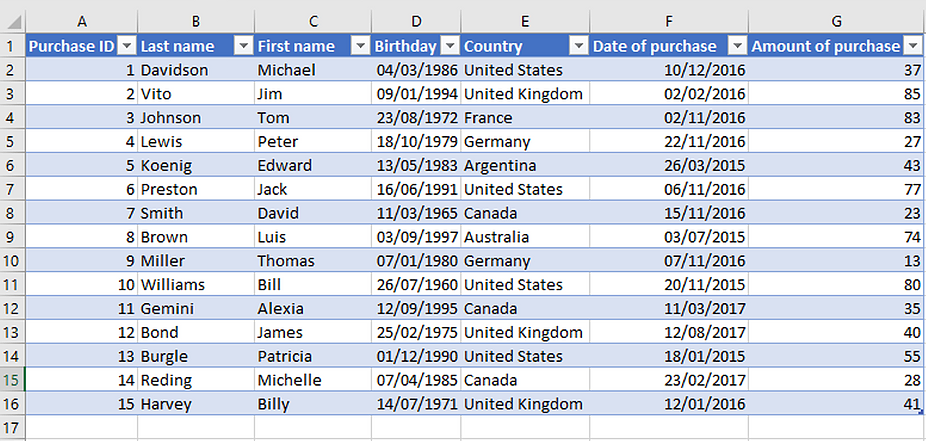
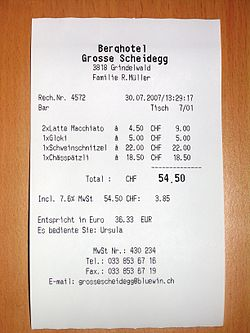
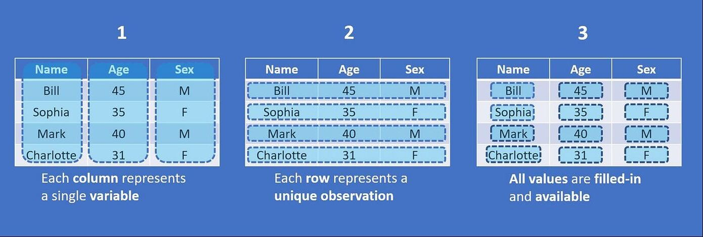

## 📋 Agenda

* **The Mission:** Your role in the Climate Crisis investigation.
* **The Lifecycle:** Mapping where we are in the journey.
* **The Blueprint:** Defining Data and its "Shapes."
* **The Tool:** Why we use R (and the R "Mindset").
* **The Language:** Deciphering Data Types.
* **The Forensic Audit:** Identifying Data Quality "Gremlins."
* **Mini-Exercise:** Putting your eyes to the test.

---

## 🎯 Today’s Objectives

*By the end of this 75-minute session, you will:*

1.  **Locate** where Data Wrangling fits in a professional workflow.
2.  **Differentiate** between Structured, Semi-Structured, and Unstructured data.
3.  **Navigate** the anatomy of a Dataframe (Rows, Columns, Cells).
4.  **Identify** specific Data Types (Numeric, Factor, Logical, etc.).
5.  **Detect** the 6 most common data quality issues in a raw dataset.

---

## 🕵️‍♂️ The Mission: Solving the Climate Crisis

You’ve been tasked with a high-stakes analysis: **Identify the main causes of global warming.**

You've heard that "Data" is the key. But before you can present to a committee or influence policy, you have to build the foundation. You can't just look at a spreadsheet and guess—you have to **interrogate** the evidence.

---

## 🔄 The Data Science Lifecycle

* **Step 1: Acquisition & Wrangling (Today):** Finding and prepping the data.
* **Step 2: EDA (Exploratory Data Analysis):** Spotting trends.
* **Step 3: Visualization:** Telling the story.
* **Step 4: Modeling:** Predicting the future.

> **Crucial Lesson:** If Step 1 is a disaster, Step 4 will be a lie. Wrangling is the "Safety Check" of Science.

---

## 💎 What is Data?

Data isn't just "stuff on a computer." Think of it as **Digital Evidence**. 

It is a captured record of a physical event. 
* A satellite measures sea levels $\rightarrow$ **The Evidence.**
* A scientist drills into an ice core to check $CO_2$ $\rightarrow$ **The Evidence.**

Your job is to determine if that evidence is reliable enough to build a case.

---

## 📦 Shape 1: Structured Data

**Our Gold Standard.**

Structured data is a clean, predictable grid where every piece of information has a specific place.   
* **Example:** A `.csv` file where every year has a row and every measurement has a column.   
* **Why we love it:** Computers are optimized to do math on a grid.   

---

## 🧾 Shape 2: Semi-Structured Data

**Organized, but "Loose."**

Think of a **Starbucks App Order** or a **Digital Receipt**. It isn't a flat grid, but it has specific "tags" that tell you what is what (e.g., `<Price>`, `<Item>`, `<Store>`). 

* It has "layers" (like one receipt having multiple items) that don't fit into a simple table without extra work.

---

## 📸 Shape 3: Unstructured Data

**The "Wild" Data.**

* **Examples:** Satellite photos of hurricanes, videos of melting glaciers, or handwritten scientist notes. 
* There are no rows or columns here—just raw pixels or sound. 

* **The Goal:** We often use AI/tools to turn this mess into **Structured Data** we can actually count.

---

## 📁 The Container: Dataset vs. Dataframe

You finally receive your structured climate file. There are two terms you’ll hear constantly:

1.  **The Dataset:** The general collection of info (the "Climate File").
2.  **The Dataframe:** R’s specific, high-powered container for your data.

> A Dataframe is **"strict."** It demands that every column be a specific type (e.g., a column of only numbers). This strictness allows R to process millions of records in a split second.

---

## 🧱 Anatomy of the Grid

* **Rows (Observations):** Each row is a single, unique event (e.g., the year 1990).
* **Columns (Variables):** The "lenses" we use to look at that year (e.g., $CO_2$ levels).
* **The Cell:** The intersection of a row and a column. This is the individual **Fact**.

---

## 🛠️ Choosing Your Tool: Why R?

* **Audit Trail (Reproducibility):** In R, you write a **Script** (a recipe). If you find a mistake in your math, you fix one line and rerun. In Excel, you have to manually re-click and drag through thousands of cells.
* **Power:** R treats columns as **Vectors**. It calculates the entire 50-year trend at once, rather than looking at cells one-by-one.

---

## 💡 R "Hacks" for the Newbie

* **The Tab Key:** Your best friend. Start typing a name, hit **Tab**, and R finishes it. 
* **The Pipe (`%>%`):** R’s way of saying **"AND THEN."** It lets you chain your thoughts together.
* **The Environment:** Think of this as your **Workbench**. If you don't "load" your dataset into the environment, R can't "see" it.

---

## 🔠 The "Translation": Data Types

R "types" your evidence so it knows what math is legal.

| Type | What it looks like | Example Column |
| :--- | :--- | :--- |
| **Numeric (Continuous)** | Counts, rates, decimals | `co2_level`, `tag_accuracy_pct` |
| **Numeric (Discrete)** | Whole numbers | `matches_played`, `year` |
| **Logical** | TRUE/FALSE flags | `injured_flag`, `ice_melt_record` |
| **Date / Time** | Calendar stamps | `last_match_date`, `reading_timestamp` |

---

## 🔠 Nominal vs. Ordinal (The Ladder)

In R, Categorical data is called a **Factor**. It comes in two flavors:

1.  **Nominal (Labels Only):** No inherent order. 
    * *Example:* **Energy Source** (Coal, Solar, Wind). One isn't "higher" than the other.
2.  **Ordinal (The Ladder):** There is a clear rank or sequence.
    * *Example:* **Climate Risk Level** (Low < Medium < High). 

---

## 🤔 Why do Data Types actually matter?

* **Math:** You can't calculate the average of "Low, Medium, High" unless you tell R they are ranked categories.
* **Charts:** If you don't define an **Ordinal** rank, R lists them alphabetically (**H**igh, **L**ow, **M**edium), making your chart look broken.
* **Logic:** You can't ask R "Is the temp > 15?" if the temp is saved as "Text."

---

## ⚠️ Defining "Messiness"

Data is rarely created for analysts; it’s created by tired humans or glitchy sensors. 

**Messiness** is any inconsistency that prevents R from doing math or creating accurate charts. If you don't find these "Gremlins" now, they will sabotage your model later.

---

## 🔍 Quality Issues: Missingness & Duplicates

1.  **Missing Values (`NA`):** Gaps in the evidence (e.g., a weather station went offline). **Note:** `NA` is not zero!
2.  **Duplicated IDs:** The same year or player entered twice. This "double-counting" will artificially inflate your averages.

---

## 🔍 Quality Issues: Casing & Impossible Numbers

3.  **Inconsistent Casing:** `neon yard` vs `Neon Yard`. To R, these are two different places.
4.  **Impossible Numbers:** A temperature of $500^{\circ}C$ or "Negative Assists." These are usually "Fat-finger" typos.

---

## 🔍 Quality Issues: Categories & Timestamps

5.  **Inconsistent Categories:** Using `Anchor` in one row and `anchor` in another.
6.  **Timestamps as Text:** Dates saved as "Jan 1st" instead of a proper `Date` type. You can't sort "text" chronologically!

---

## 🧩 Mini-Exercise: Spot the Gremlins

**How many issues can you find?**

| ID | Year | Location | Temp_C | Sensor_Active |
| :--- | :--- | :--- | :--- | :--- |
| 101 | 1990 | Arlington | 14.5 | TRUE |
| 102 | 1991 | arlington | **NA** | TRUE |
| **101** | 1990 | Arlington | 14.5 | TRUE |
| 103 | 1992 | Arlington | **500.0** | FALSE |
| 104 | **"1993"** | ARLINGTON | 15.2 | **"Yes"** |

---

## 🏁 The First Audit: Summary

Today was about **Discovery**. You have moved from "I have a file" to "I have a map of the file's flaws." 

**What you’ve mastered:**   
1.  Identifying the **Shape** of your evidence.   
2.  Recognizing the **Types** (Numeric vs. Factor).   
3.  Spotting the **Gremlins** before they ruin your model.   

---

## ⏭️ Next Session: The Surgery

Now that we know what's broken, how do we fix it?

**In Session 2, we will cover:**   
* **Tidyverse Verbs:** The "surgical tools" for data.   
* **Filtering:** Cutting out the outliers (the $500^{\circ}C$ days).   
* **Mutating:** Converting "Text" years into "Numeric" years.   
* **Summarizing:** Turning 50 years of data into a single, clean trend.   