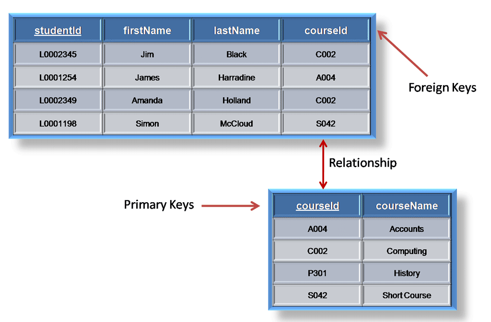
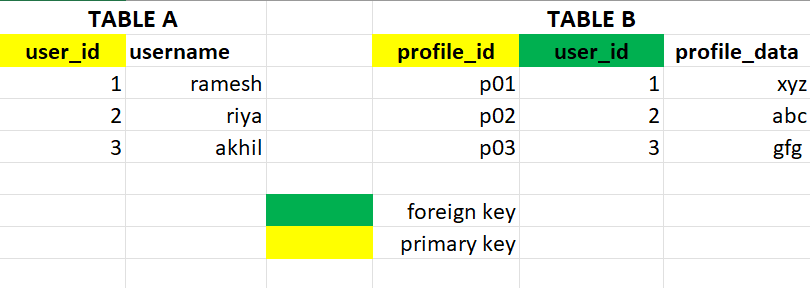
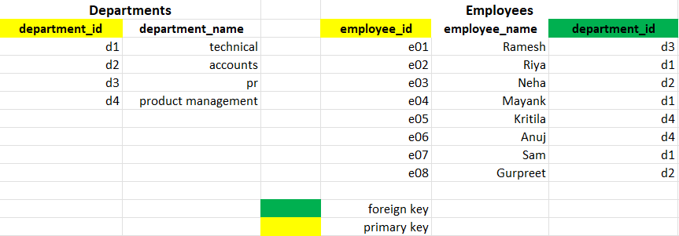
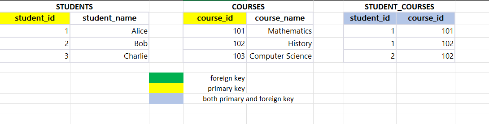
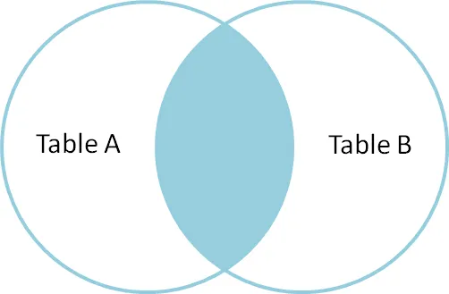
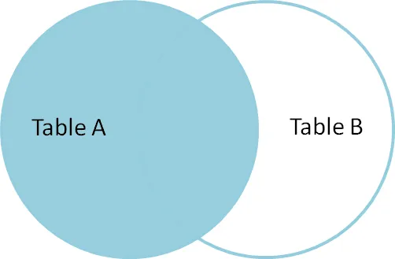
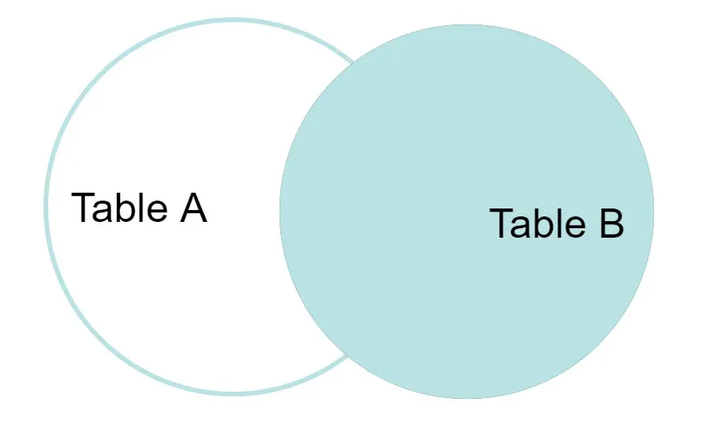
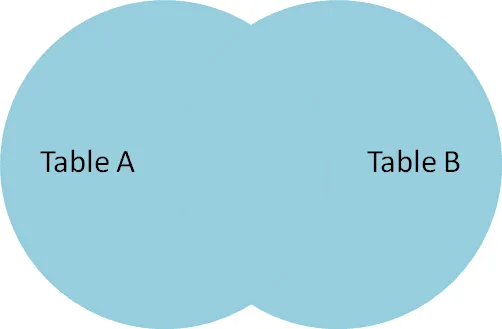

## 📋 Agenda

* **The Why:** Why integration is the core of real analysis.
* **Keys:** Primary vs. foreign keys and table relationships.
* **Joins:** What each join keeps and loses.
* **Pitfalls:** Dupes, missing keys, dirty strings.
* **Pivoting:** Wide ↔ Long and why it matters.
* **Ratios:** Turning counts into signal.
* **Quality Checks:** Trust, but verify.

---

## 🎯 Today’s Objectives

*By the end of this session, you will:* 

1. **Define** primary and foreign keys and recognize table relationships.
2. **Choose** the correct join type for a policy question.
3. **Prevent** common join failures (duplicates, missing keys, mismatched text).
4. **Reshape** data with pivots for analysis and visualization.
5. **Create** ratios safely and interpret them correctly.

---

## 🧭 Why Integration Matters

* Real analyses rarely live in one table.
* Most policy questions require **demand + supply**, **people + places**, or **outcomes + programs**.
* Integration errors are silent—they *look* correct but change conclusions.

> **Rule:** If the join is wrong, the story is wrong.

---

## 🔑 Keys 101: Primary vs. Foreign

* **Primary Key:** Unique ID in a table (no duplicates).
* **Foreign Key:** Column that points to a primary key in another table.
* Keys define how tables relate and prevent ambiguity.

---

## 🔑 Keys 101: Visual

{width=70% fig-align="center"}

---

## 🗂️ Relationships

* **One-to-One:** Each key appears once in both tables.
* **One-to-Many:** One key in Table A appears multiple times in Table B.
* **Many-to-Many:** Both sides repeat → requires caution (row explosion risk).

---

## 🗂️ Relationship Patterns

**One-to-One**

{width=95% fig-align="center"}

**One-to-Many**

{width=95% fig-align="center"}

**Many-to-Many**

{width=95% fig-align="center"}

---

## 🧭 Why Relationships Matter for Joins

* Relationship types describe **how two tables connect**
* They tell you **how many rows to expect** after a join.
* They flag **where duplication can happen** (and when it is expected).
* They indicate **when you should aggregate first** to avoid inflation.

---

## 🧭 Relationship Type

| Relationship | Join Expectation | Risk if Ignored |
|---|---|---|
| One-to-One | Row counts stay stable | Hidden mismatches or dropped rows |
| One-to-Many | Rows expand on the many side | Double-counting if you sum |
| Many-to-Many | Rows explode rapidly | Fake totals, distorted ratios |

---

## 🧩 Join Types

* **Inner Join:** Only matches in both tables.
* **Left Join:** Keep all from left, match from right.
* **Right Join:** Keep all from right, match from left.
* **Full Join:** Keep everything from both tables.

---

## 🧩 Join Types: Intuition

* **Inner:** “Show only places where both programs and outcomes exist.”
* **Left:** “Keep every community in the audit, even if missing data.”
* **Full:** “Preserve all records to inspect gaps.”

---

## 🧩 Inner Join 

::: {.columns}
::: {.column width="50%"}
**Raw (Students + Enrollments)**

| student_id | student_name |
|---|---|
| 1 | Amina |
| 2 | Ben |
| 3 | Chao |
| 4 | Dani |

| student_id | class_id |
|---|---|
| 1 | 101 |
| 1 | 102 |
| 2 | 101 |
| 5 | 103 |
:::
::: {.column width="50%"}
{width=90% fig-align="center"}

**Result**

| student_id | student_name | class_id |
|---|---|---|
| 1 | Amina | 101 |
| 1 | Amina | 102 |
| 2 | Ben | 101 |
:::
:::

---

## 🧩 Left Join 

::: {.columns}
::: {.column width="50%"}
**Raw (Students + Enrollments)**

| student_id | student_name |
|---|---|
| 1 | Amina |
| 2 | Ben |
| 3 | Chao |
| 4 | Dani |

| student_id | class_id |
|---|---|
| 1 | 101 |
| 1 | 102 |
| 2 | 101 |
| 5 | 103 |
:::
::: {.column width="50%"}
{width=90% fig-align="center"}

**Result**

| student_id | student_name | class_id |
|---|---|---|
| 1 | Amina | 101 |
| 1 | Amina | 102 |
| 2 | Ben | 101 |
| 3 | Chao | NA |
| 4 | Dani | NA |
:::
:::

---

## 🧩 Right Join 

::: {.columns}
::: {.column width="50%"}
**Raw (Students + Enrollments)**

| student_id | student_name |
|---|---|
| 1 | Amina |
| 2 | Ben |
| 3 | Chao |
| 4 | Dani |

| student_id | class_id |
|---|---|
| 1 | 101 |
| 1 | 102 |
| 2 | 101 |
| 5 | 103 |
:::
::: {.column width="50%"}
{width=90% fig-align="center"}

**Result**

| student_id | student_name | class_id |
|---|---|---|
| 1 | Amina | 101 |
| 1 | Amina | 102 |
| 2 | Ben | 101 |
| 5 | NA | 103 |
:::
:::

---

## 🧩 Full Join 

::: {.columns}
::: {.column width="50%"}
**Raw (Students + Enrollments)**

| student_id | student_name |
|---|---|
| 1 | Amina |
| 2 | Ben |
| 3 | Chao |
| 4 | Dani |

| student_id | class_id |
|---|---|
| 1 | 101 |
| 1 | 102 |
| 2 | 101 |
| 5 | 103 |
:::
::: {.column width="50%"}
{width=90% fig-align="center"}

**Result**

| student_id | student_name | class_id |
|---|---|---|
| 1 | Amina | 101 |
| 1 | Amina | 102 |
| 2 | Ben | 101 |
| 3 | Chao | NA |
| 4 | Dani | NA |
| 5 | NA | 103 |
:::
:::

---

## ⚠️ Join Pitfall #1: Duplicate Keys

* Duplicate keys create **row multiplication**.
* A 1-to-M join can become M-to-M if both sides repeat.
* Result: inflated counts, fake totals, incorrect ratios.

---

## ⚠️ Pitfall #1: Duplicate Keys 

::: {.columns}
::: {.column width="50%"}
**Raw**

| student_id | student_name |
|---|---|
| 1 | Amina |
| 1 | Amina |
| 2 | Ben |

| student_id | class_id |
|---|---|
| 1 | 101 |
| 1 | 102 |
| 2 | 101 |
:::
::: {.column width="50%"}
**Result (Row Explosion)**

| student_id | student_name | class_id |
|---|---|---|
| 1 | Amina | 101 |
| 1 | Amina | 102 |
| 1 | Amina | 101 |
| 1 | Amina | 102 |
| 2 | Ben | 101 |
:::
:::

---

## ⚠️ Join Pitfall #2: Missing Keys

* Missing foreign keys drop rows in inner joins.
* If missingness is meaningful, use a left or full join.
* Always count dropped rows and inspect what was lost.

---

## ⚠️ Pitfall #2: Missing Keys 

::: {.columns}
::: {.column width="50%"}
**Raw**

| student_id | student_name |
|---|---|
| 1 | Amina |
| 2 | Ben |
| 3 | Chao |

| student_id | class_id |
|---|---|
| 1 | 101 |
| 2 | 101 |
:::
::: {.column width="50%"}
**Result (Inner Join)**

| student_id | student_name | class_id |
|---|---|---|
| 1 | Amina | 101 |
| 2 | Ben | 101 |
:::
:::

---

## ⚠️ Join Pitfall #3: Dirty Strings

* “Seattle” ≠ “seattle” ≠ “Seattle ”.
* Casing, whitespace, and punctuation break matches.
* Standardize text before joining

---

## ⚠️ Pitfall #3: Dirty Strings 

::: {.columns}
::: {.column width="50%"}
**Raw**

| campus_name | campus_id |
|---|---|
| Seattle | 001 |
| Austin | 002 |
| Boston | 003 |

| campus_name | incidents |
|---|---|
| seattle | 1 |
| Austin | 2 |
| Boston  | 3 |
:::
::: {.column width="50%"}
**Result (Inner Join)**

| campus_name | campus_id | incidents |
|---|---|---|
| Austin | 002 | 2 |
| Boston | 003 | 3 |
:::
:::

---

## 🧩 Aggregate Before Joining

* Summarize first to avoid duplication.
* Example: count by city, then join on city.
* This preserves 1 row per key and prevents inflation.

---

## 🧩 Aggregate Before Joining (Setup)

**Question:** "Applicants per program by region"

::: {.columns}
::: {.column width="50%"}
**Applications (many rows per region)**

| applicant_id | region |
|---|---|
| 1001 | North |
| 1002 | North |
| 1003 | South |
| 1004 | South |
| 1005 | South |
| 1006 | East |
:::
::: {.column width="50%"}
**Programs (one row per region)**

| region | programs |
|---|---|
| North | 5 |
| South | 2 |
| East | 3 |
| West | 1 |
:::
:::

---

## 🧩 Join First, Then Group (Wrong)

::: {.columns}
::: {.column width="50%"}
**Joined Table (applications ⨝ programs)**

| applicant_id | region | programs |
|---|---|---|
| 1001 | North | 5 |
| 1002 | North | 5 |
| 1003 | South | 2 |
| 1004 | South | 2 |
| 1005 | South | 2 |
| 1006 | East | 3 |
:::
::: {.column width="50%"}
**Wrong if you sum programs**

| region | programs_sum |
|---|---|
| North | 10 |
| South | 6 |
| East | 3 |
:::
:::

---

## 🧩 Aggregate Before Joining (Correct)

::: {.columns}
::: {.column width="50%"}
**Applicants per Region (aggregate first)**

| region | applicants |
|---|---|
| North | 2 |
| South | 3 |
| East | 1 |
:::
::: {.column width="50%"}
**Join After Aggregation**

| region | applicants | programs |
|---|---|---|
| North | 2 | 5 |
| South | 3 | 2 |
| East | 1 | 3 |
| West | NA | 1 |
:::
:::

---

## 📊 Counts vs. Ratios

* **Counts** answer “how many”.
* **Ratios** answer “how pressured” or “how available”.
* **Why here?** Joins bring demand and supply into one row so a ratio is even possible.
* Ratios are often the fairer comparison across regions.

---

## 📊 Ratios Example 

::: {.columns}
::: {.column width="50%"}
**Raw Joined Table**

| region | applicants | programs |
|---|---|---|
| North | 200 | 5 |
| South | 140 | 2 |
| East | 60 | 3 |
| West | 40 | 1 |
:::
::: {.column width="50%"}
**Result: applicants_per_program**

| region | applicants_per_program |
|---|---|
| North | 40 |
| South | 70 |
| East | 20 |
| West | 40 |
:::
:::

---

## ⚠️ Ratio Guardrails

* Think about when you left join... There can be some missing rows right? 
* NA * Anything = ?
* Now, let's say you filled it with 0:
* Never divide by zero → define a safe rule.
* Watch for missing denominators.

---

## ⚠️ Ratio Guardrails 

::: {.columns}
::: {.column width="50%"}
**Raw Joined Table**

| region | applicants | programs |
|---|---|---|
| North | 200 | 5 |
| South | 140 | 0 |
| East | 60 | NA |
| West | NA | 1 |
:::
::: {.column width="50%"}
**Bad Result**

| region | applicants_per_program |
|---|---|
| North | 40 |
| South | ∞ (divide by 0) |
| East | NA |
| West | NA |
:::
:::

---

## ✅ Post-Join Quality Checks

* Check row counts before and after joins.
* Validate key uniqueness.
* Spot-check totals and missingness.
* Confirm the story still makes sense.

---

## 📉 Pivoting: Wide ↔ Long

* **Wide:** Many columns, fewer rows (good for tables).
* **Long:** One column for values, one for labels (good for analysis).
* Most plots and group operations prefer **long** format.

---

## 🧭 Why Long Format Wins

* Easy grouping and filtering.
* One aesthetic mapping handles all categories.
* Cleaner legends and faceting in charts.

---

## 🔁 Pivot Example: Wide → Long 

::: {.columns}
::: {.column width="50%"}
**Raw Wide**

| school | math | reading |
|---|---|---|
| Adams | 82 | 88 |
| Burke | 76 | 91 |
:::
::: {.column width="50%"}
**Result Long**

| school | subject | score |
|---|---|---|
| Adams | math | 82 |
| Adams | reading | 88 |
| Burke | math | 76 |
| Burke | reading | 91 |
:::
:::

---

## 🔁 Pivot Example: Long → Wide 

::: {.columns}
::: {.column width="50%"}
**Raw Long**

| school | subject | score |
|---|---|---|
| Adams | math | 82 |
| Adams | reading | 88 |
| Burke | math | 76 |
| Burke | reading | 91 |
:::
::: {.column width="50%"}
**Result Wide**

| school | math | reading |
|---|---|---|
| Adams | 82 | 88 |
| Burke | 76 | 91 |
:::
:::

---

## 🧰 Integration Checklist

1. **Keys defined?** Primary + foreign confirmed.
2. **Join chosen?** Matches the policy question.
3. **Duplicates handled?** No row explosions.
4. **Missingness reviewed?** Losses understood.
5. **Ratios safe?** Denominator protected.
6. **Pivot correct?** Shape supports analysis.

---

## 🏁 Wrap-Up

* Integration is where most analysis succeeds or fails.
* Keys, joins, pivots, and ratios are the core toolkit.
* Every join should be justified and verified.
