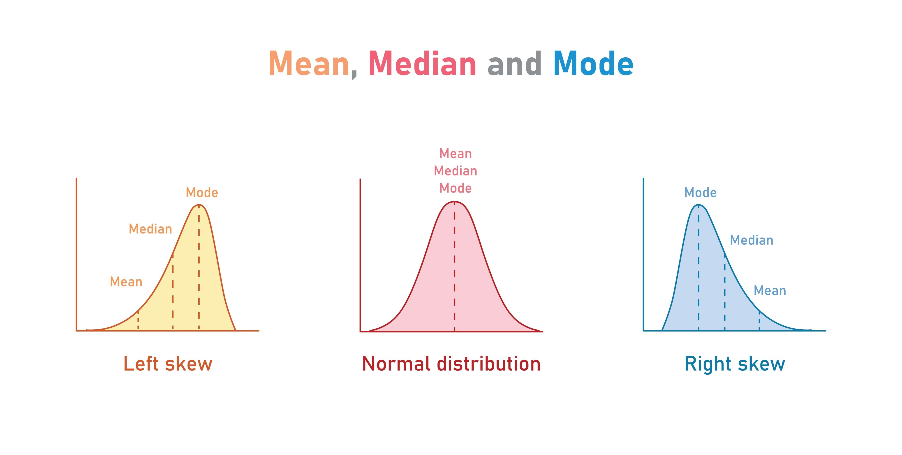

## 🧠 Week 4: The Logic of Inference

* **Exploratory Data Analysis**: What do we see?
* **Inference**: What can we claim?

> Seeing a pattern is easy.  
> Proving it is hard.

---

## 🎯 Hypothesis Testing

Hypothesis testing is checking whether an intution happens by **just chance/luck**.

> Using data, we try to challenge the "no-difference" world and claim that "there is a difference"

---

## ❓ So How Do We Do It?

* Well... You first need a question!
    * “Do Battery EVs and Plugin Hybrid EVs have different average range?”
* Define $H_0$ and $H_a$
  * $H_0$: No there is no difference between BEV and PHEV average range.
  * $H_a$: Yes, there is a difference between BEV and PHEV average range.
* Test your theory!
* See the probability of $H_0$ happening.
* Decide how much of "chance" are you comfortable accepting ($\alpha$)

---

## 🧾 Example: Question → $H_0$ / $H_a$

**Question:** Do BEVs and PHEVs have different average range?

$$
H_0: \mu_{BEV} = \mu_{PHEV}
$$

$$
H_a: \mu_{BEV} \neq \mu_{PHEV}
$$

**Meaning:**  

* $H_0$ says gap between the two averages is ignorable because it could be just caused by outliers or sampling errors. 
* $H_a$ says teh gap between the two averages are statistically provable.

---

## 🧪 Which Test Should I Use?

* Numeric outcome + 2 groups → **t-test**
  * “Do BEVs and PHEVs have different average range?”

* Numeric outcome + 3+ groups → **ANOVA**
  * “Do Public, Private, and Unknown stations differ in average Level 2 ports?”
  
* Both categorical → **Chi-square**
  * “Is EV type related to county (top 3 counties)?”
  
---

## ❓ Does this actually work in real life?

* Remeber Normal Distribution? 
* In real life, is data really normal? 
* So if the data doesn't portray the "typical", what's the point?

{width=90% fig-align="center"}

## 🧭 Why We Compare Groups

* The "population data" is collection of **individual observations**.
* Person‑to‑person comparisons are noisy because **everyone is different**.
* But let's think about this in terms of groups:
  * Group comparisons let us **generalize**:  
  * “What is typical for Group A vs Group B?”
  * Individual quirks shrink, **shared patterns grow**.

---

## 🧮 Central Limit Theorem (CLT)

* And this leads us to the Central Limit Theorem
* When we **group**, we focus on the **average** of each group.
  * So let's say from 1 Million Records, I sample 1000 records and take the average
  * I repeat this step 1000 times.
  * What would happen?
* CLT says those averages behave predictably around a **typical center**.
* That’s why inference works even when individuals vary a lot.

**One sentence:**

> Sample means become approximately normal as sample size grows — even if the population is skewed.

---

## 🧮 Why CLT Matters for These Tests

* Tests we are covering compare **averages**, not every single value.
* CLT tells us those **averages behave predictably**, even when raw data are skewed.
* **But what's the caveat?**
  * We need a lot of data!
  * If we are sampling from the same 100 observations, there is no variation.
  * But what if we have 1 Million? That has to capture the big picture right?

---

## 👥 Population vs Sampling Distribution

* Population may be skewed
* Sample averages form a bell curve

> We are not assuming the world is normal.  
> We assume the average behaves normally.

---

## 📏 Standardization

Let's say we calculated the average number of chargers for each county:

* Is 50 chargers a lot?
* Depends right? Compared to what?

We need a universal language.

---

## ⚖️ Why Standardize to Compare Groups Fairly

* Groups can have **different sizes** and **different spreads**.
* Raw differences aren’t comparable across groups.
* Standardization puts everything on the **same scale**.

---

## 🔢 Z-score Definition

A z-score converts a value into:

> How many standard deviations away from the average is this?

$$
z = \frac{x - \mu}{\sigma}
$$

---

## 🧪 Worked Example: Charging Stations

Suppose across WA counties:

* Mean: $\mu = 20$
* SD: $\sigma = 10$

King County:

* Observed: $x = 50$

$$
z = \frac{50 - 20}{10} = 3
$$

This is saying:

> King County's 50 chargers is 3 standard deviations away from the **average of average** number of chargers in each county.

---

## 🧭 Interpreting Z-scores

Remember the **3 standard deviation rule** for outliers?

* z = 0 → typical
* z = 1 → somewhat above average
* z = 2 → rare
* z = 3 → extremely unusual

> Z-scores measure rarity, not size.

---

## 🧪 So... Z-score for every test?

Every test statistic is a standardized difference:

$$
\text{Signal} \div \text{Noise}
$$

> Test statistics are z-scores in disguise.

---

## 🧪 Standardization Inside Every Test

* Becasue we are comparing group(s), tests measure **difference** on a shared scale.
* That makes comparisons fair across groups and outcomes.
* t, F, and $\chi^2$ are different **standardized** ways to measure “how far.”

---

## ❓ What is a p-value?

* So now we have a method of comparing the different groups.
* We then have to know, what's the **likelihood** of the **Reality** happening if we assumed $H_0$? 

$$
p = P(\text{data as extreme as ours} \mid H_0)
$$

Plain language:

> If the null were true, how often would we see something like reality by chance?

---

## 🧱 But am I comfortable?

* Let's say the p-value was 10%
* This means: "Our reality can happen only 10% of the time in the world of Null Hypothesis"
* Is that good enough for you to say, **"10% is good enough"**
* How much risk are we willing to tolerate?

That line is $\alpha$.

---

## 🧪 Why 0.05?

* Fisher’s historical convention (“1 in 20”)
* Not a law of nature

$$
\alpha = 0.05
$$

Means:

> We accept a 5% false positive risk.

---

## 🧪 Different Fields Use Different $\alpha$

| Field                | Typical $\alpha$   | Why                  |
| -------------------- | ------------------ | -------------------- |
| Social science       | 0.05–0.10          | Noisy data           |
| Medicine             | 0.01               | Patient harm         |
| Genomics             | 0.001+             | Many tests           |
| Engineering safety   | Very small         | Catastrophic failure |
| Business A/B testing | 0.05 + effect size | Practical focus      |

---

## 🗂️ Data We’ll Use Today

```{r, label="r_setup", echo=TRUE}
library(dplyr)
library(readr)
library(stringr)
library(tidyr)

ev_pop <- read_csv("../../data/wa_ev_population.csv")
ev_stations <- read_csv("../../data/wa_ev_charge_stations.csv")

stations_clean <- ev_stations %>%
  mutate(
    station_group = case_when(
      str_detect(station_group, "Public") ~ "Public",
      str_detect(station_group, "Private") ~ "Private",
      TRUE ~ "Unknown"
    ),
    station_group = factor(station_group)
  )
```

---

## 🧪 t-test Hypotheses

**Question:** Do Public and Private stations differ in average number of Level 2 ports?

$$
H_0: \mu_{Public} = \mu_{Private}
$$

$$
H_a: \mu_{Public} \neq \mu_{Private}
$$

---

## 🧪 t-test: What’s Happening in the Background

* Compute the **average Level 2 ports** for Public and for Private.
* Imagine **re-shuffling the group labels** many times.
* Each shuffle gives a “no‑difference” gap (what we’d expect if $H_0$ were true).
* Ask: “Is our real gap **much larger** than most of those shuffled gaps?”
* Turn that into a **t-value** and **p-value**.

---

## 🧪 t-test (EV Stations)

```{r}
t_test_data <- stations_clean %>%
  filter(station_group %in% c("Public", "Private")) %>%
  mutate(ev_lvl_2 = replace_na(ev_lvl_2, 0))

t_test <- t.test(ev_lvl_2 ~ station_group, data = t_test_data)
t_test
```

---

## 🤔 What Are We Looking At?

* A test statistic (t)
* Degrees of freedom
* A p-value
* A confidence interval

---

## 🧾 t-test Results (Plain Language)

**Output values**

* t = `r round(t_test$statistic, 2)`
* df = `r round(t_test$parameter, 1)`
* p-value = `r signif(t_test$p.value, 3)`
* 95% CI = `r paste0("[", round(t_test$conf.int[1], 2), ", ", round(t_test$conf.int[2], 2), "]")`

**What this means (in context of $H_0$ / $H_a$)**

* The **t-value** shows how big the Public vs Private difference is **compared to random variation**.
* The **p-value** tells how likely we’d see a gap this large **if $H_0$ (no difference) were true**.
* The **CI** shows reasonable values for the **difference in averages** between Public and Private.

**Conclusion (plain language)**

`r if (t_test$p.value < 0.05) { "We would reject $H_0$: Public vs Private stations differ in average Level 2 ports." } else { "We would fail to reject $H_0$: We do not have evidence of a difference in average Level 2 ports." }`

---

## 📏 t-value: What It Is

* If we assume that $H_0$ is real, the **typical** gap would be **0**
* **t-value** shows: how many standard error away was the **actual** difference relative to the typical **if $H_0$ were true**?
* Large |t| → stronger evidence against $H_0$
* Example: a t of **2.28** means the gap is **2.28 standard errors** away from zero.

---

## 🧪 t-value: How It’s Used

* Imagine re‑sampling many times **if $H_0$ were true** (average gap = 0).
* Each re‑sample gives a t‑value; most are near **0**.
* We ask: “How often do we see a t **as big as ours**?”
* That fraction is the **p‑value**.
* Small p‑value → our t is rare under $H_0$.
* This is saying: 
> This "reality" is not likely to happen if we believed in the Null Hypothesis

---

## 🎯 Confidence Interval (t-test Context)

* The 95% CI is a **plausible range** for the average difference (Public − Private).
* If the CI is **[2, 6]**, it suggests Public stations average **2–6 more** Level 2 ports.
* If the CI crosses **0**, the difference could be **none**.

---

## 🎯 Degrees of Freedom (t-test)

* We estimate **two means** (one per group), which “uses up” 2 pieces of information.
* So we start with **n₁ + n₂** data points and subtract **2**.  
  Result: **n₁ + n₂ − 2**.
* More degrees of freedom → more stable estimate.

---

## 📄 Reading `t.test()` Output

Look for:

* t value
* degrees of freedom
* p-value
* confidence interval

We care about:

* Direction (means)
* Evidence (p)
* Magnitude (CI)

---

## 🧪 ANOVA Hypotheses (Example)

**Question:** Do station groups differ in DC fast port counts?

$$
H_0: \mu_{Public} = \mu_{Private} = \mu_{Unknown}
$$

$$
H_a: \text{At least one group mean differs}
$$

---

## 🧪 ANOVA: What’s Happening in the Background

* Compute the **average DC fast ports** for each station group.
* Imagine **re-shuffling group labels** many times.
* Each shuffle shows how different group averages look **when $H_0$ is true**.
* Ask: “Are our real group differences **much larger** than those shuffled ones?”
* Turn that into an **F value** and **p-value**.

---

## 🧪 ANOVA (EV Stations)

```{r}
anova_data <- stations_clean %>%
  mutate(ev_dc_fast_count = replace_na(ev_dc_fast_count, 0))

anova_fit <- aov(ev_dc_fast_count ~ station_group, data = anova_data)
summary(anova_fit)
```

---

## 🤔 What Are We Looking At?

* An F statistic
* A p-value
* Evidence of **any** group differences

---

## 🧾 ANOVA Results (Plain Language)

```{r}
anova_summary <- summary(anova_fit)[[1]]
anova_f <- anova_summary$`F value`[1]
anova_p <- anova_summary$`Pr(>F)`[1]
```

**Output values**

* F = `r round(anova_f, 2)`
* p-value = `r signif(anova_p, 3)`

**What this means (in context of $H_0$ / $H_a$)**

* The **F value** checks whether the station groups differ **more than we’d expect by chance**.
* The **p-value** tells how unlikely those group differences are **if $H_0$ (all means equal) were true**.

**Conclusion (plain language)**

`r if (anova_p < 0.05) { "We would reject $H_0$: At least one station group differs in average DC fast ports." } else { "We would fail to reject $H_0$: No evidence of differences among station groups for DC fast ports." }`

---

## 🧪 Where Does the F Value Come From?

* For actuals, let's say we calculate **within variance** and **between-group variance**
* **Between Group Variance** will show how far apart each group is when sampled
* **Within Group Variance** will show the **spread** of each group
* We look at ratio of **Between** and **Within**
* F only becomes big if Between variance is relatively greater than Within variance
  * Even if the Between variance is big, if the averages within each group is spread out, this is not conclusive (F is small)
  * It's only when there is a **distinct** difference in the groups despite the **within** we see a big F

## 🧪 F value: How It’s Used

* Compare F to an F distribution (calculation for all samples)
  * Where does the **reality** lie in comparison to the sampled result?
* If our F value is extreme relative to samples, what does that mean?
* Produces a **p-value**
  * Under the assumption of $H_0$ how likely is our actual supposed to happen?
* Tells whether **any** group mean differs (not which one)

---

## 📄 Reading ANOVA Output

Look for:

* F value
* Pr(>F) = p-value

Key reminder:

> ANOVA tells you *some* difference exists.

---

## 🧪 Chi-square Hypotheses (Example)

**Question:** Is station group related to having any DC fast ports?

$$
H_0: \text{Station group and fast-port presence are independent}
$$

$$
H_a: \text{They are associated}
$$

---

## 🧪 Chi-square: What’s Happening in the Background

* Build a **count table** of station group by fast‑port presence.
* Imagine **randomly mixing** the categories many times.
* That gives the “no‑relationship” tables (what we’d expect if $H_0$ were true).
* Ask: “Is our real table **very different** from most of those?”
* Turn that into a **$\chi^2$ value** and **p-value**.

---

## 🧪 Chi-square (EV Stations)

```{r}
chisq_data <- stations_clean %>%
  mutate(
    ev_dc_fast_count = replace_na(ev_dc_fast_count, 0),
    has_fast = ifelse(ev_dc_fast_count > 0, "Yes", "No")
  )

chisq_test <- chisq.test(table(chisq_data$station_group, chisq_data$has_fast))
chisq_test
```

---

## 🤔 What Are We Looking At?

* A $\chi^2$ statistic
* Degrees of freedom
* A p-value

---

## 🧾 Chi-square Results (Plain Language)

**Output values**

* $\chi^2$ = `r round(chisq_test$statistic, 2)`
* df = `r chisq_test$parameter`
* p-value = `r signif(chisq_test$p.value, 3)`

**What this means (in context of $H_0$ / $H_a$)**

* The **$\chi^2$ statistic** shows how different the table is from **what we’d expect by chance**.
* The **p-value** tells how unlikely that difference is **if $H_0$ (no relationship) were true**.

**Conclusion (plain language)**

`r if (chisq_test$p.value < 0.05) { "We would reject $H_0$: Station group and fast-port presence appear associated." } else { "We would fail to reject $H_0$: No evidence that station group and fast-port presence are related." }`

---

## 📊 $\chi^2$: What It Is

* **Chi-square statistic** measures **observed vs. expected** counts
  * **Observed**: How many do we see in our data? (The actual)
  * **Expected**: If we assumed $H_0$, this means that the overall segmentation should be applied to both groups
* Big $\chi^2$ → observed counts deviate a lot from independence
* Small $\chi^2$ → counts look close to what independence predicts

---

## 📊 $\chi^2$: Observed vs Expected (Example)

**Observed (actual counts)**

|              | BEV | PHEV | Total |
|---|---:|---:|---:|
| King County  | 600 | 400 | 1000 |
| Pierce County| 200 | 300 | 500  |
| **Total**    | 800 | 700 | 1500 |

**Expected (if $H_0$ is true: same overall mix in each county)**

|              | BEV | PHEV |
|---|---:|---:|
| King County  | 533 | 467 |
| Pierce County| 267 | 233 |

**Why:** Overall BEV share = 800/1500, PHEV share = 700/1500.

---

## 🧪 $\chi^2$: How It’s Used

* Compare $\chi^2$ to a chi-square distribution
* Produces a **p-value**
* Under the assumption of $H_0$, is our actual's $\chi^2$ extreme?

---

## 📄 Reading `chisq.test()` Output

Look for:

* χ² statistic
* df
* p-value
* expected counts

---

## 🎯 Confidence Intervals

CI answers:

> What range of true effect sizes is consistent with our data?

* CI excludes 0 → aligns with significance
* CI includes 0 → effect could be none

> CI gives magnitude + uncertainty.

---

## 🎯 Confidence Intervals (Plain Language)

* A 95% CI is a **reasonable range** for the true group difference.
* If the CI is **[2, 6]**, Public stations likely average **2–6 more** Level 2 ports.
* If the CI crosses **0**, the data are consistent with **no difference**.
* CI shows **how big** the effect might be, not just whether it exists.

## 🧾 How to Interpret Any Test Result (Template)

1. Question
2. $H_0$, $H_a$
3. Test used + why
4. Statistic (t / F / χ²)
5. p-value (surprise under $H_0$)
6. Decision
7. Confidence interval (if numeric)
8. Practical significance
9. Caveat: correlation ≠ causation

---

## 🧭 How Tests Reuse the Z-score Idea

* **t-test:** compare **two averages**, then scale by **how spread out** the data are  
  → “Is the average gap big compared to typical variation?”
* **ANOVA:** compare **several averages**, then scale by **typical variation**  
  → “Are the group averages far apart compared to typical variation?”
* **Chi-square:** compare **actual counts** to **expected counts**  
  → “Is the difference big compared to what we’d expect from random variation?”

---

## ✅ Wrap-up

* Hypothesis testing checks intuition vs chance
* CLT explains why averages behave well
* p-value = evidence against $H_0$
* t / F / χ² are standardized “surprise” measures

---

## 🧾 Exit Ticket

1. In one sentence: what is a p-value?
2. Which error is worse in a safety context: Type I or Type II, and why?
